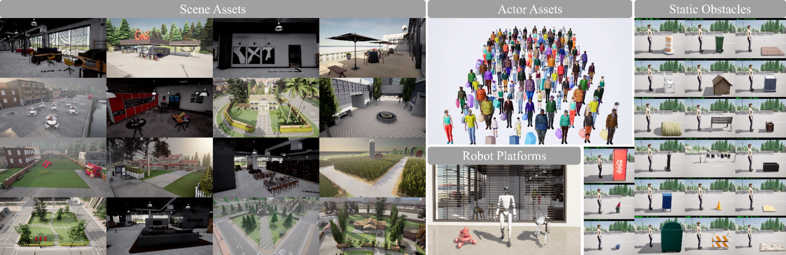
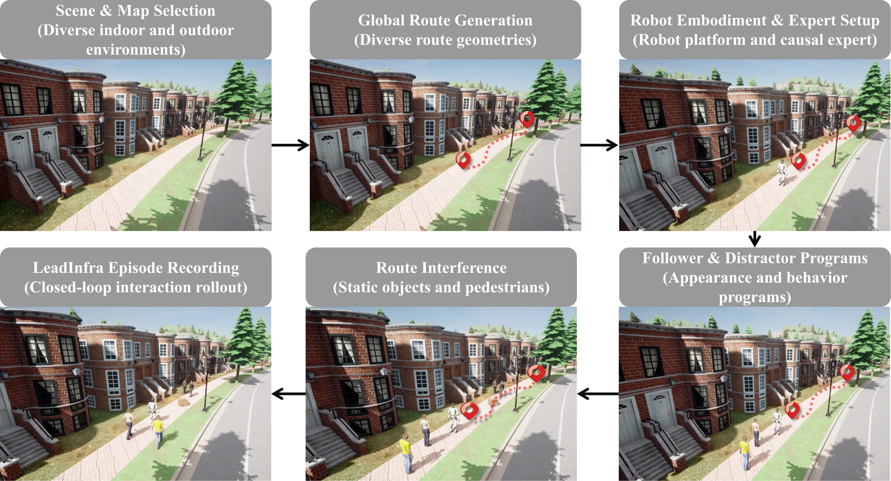

# LeadInfra — interaction-construction tools

[Repository](../README.md) · [LeadVLA](../leadvla/README.md) · [LeadBench](../leadbench/README.md) · [Examples](../examples/README.md)

LeadInfra structures robot-leading episodes through routes, robot embodiments,
follower/distractor appearances, interaction programs and scene variation.
This package provides portable composition, geometry, asset interfaces and
recording tools; simulator assets and behavior executors are supplied separately.

<p align="center">
  <a href="../docs/figures/leadinfra-assets.webp"></a>
</p>
<p align="center"><em>Diverse environments, embodiments and appearances for robot-leading interactions.</em></p>

<details>
<summary><strong>How is the data generated?</strong></summary>

<p align="center">
  <a href="../docs/figures/leadinfra-generation.webp"></a>
</p>

LeadInfra builds an episode, lets the interaction unfold in closed loop, and
generates supervision from what actually happens.

</details>

## Code map

| File | Main interface | Responsibility |
| --- | --- | --- |
| [compose.py](compose.py) | `compose`, `python -m leadinfra.compose` | Seeded episode specifications and configuration hashes |
| [quotas.py](quotas.py) | `largest_remainder` | Exact integer allocation from sampling weights |
| [catalog.py](catalog.py) | `Asset`, `Catalog`, `appearance_combinations` | Portable asset registration and caller-defined compatibility |
| [routes.py](routes.py) | `GridMap`, `ArcLengthPath`, `plan_route` | Navigability, clearance-aware A*, sampling and projection |
| [validation.py](validation.py) | `validate_route`, `route_distance` | Clearance/curvature checks and geometric redundancy |
| [recording.py](recording.py) | `EpisodeRecorder` | Append-only physical trace recording |

## Compose an episode specification

Run from the **repository root**. The composition example needs only the base
package, without PyTorch, SciPy or a simulator:

```bash
python -m pip install -e .
python -m leadinfra.compose examples/composition.json
```

To save the generated JSON:

```bash
mkdir -p outputs
python -m leadinfra.compose examples/composition.json > outputs/composition.json
```

The [example configuration](../examples/composition.json) contains:

| Field | Purpose |
| --- | --- |
| `seed`, `episodes` | Deterministic sampling and requested episode count |
| `environments`, `routes`, `robots` | Semantic IDs for task geometry and embodiment |
| `actors`, `scenes`, `sensors` | Appearance, scene and sensor choices |
| `compatible_interactions` | Explicitly allowed motion/presence/formation/person-count combinations |

The output contains `schema_version`, `kind`, `config_sha256` and an `episodes`
list. Each episode names a nominal route, robot, target/distractor appearances,
scene, sensors and interaction setting. Identical configuration and seed produce
identical output, independent of the configuration file's location.

The bundled IDs are illustrative. Composition does not resolve meshes, validate
physical feasibility or execute follower programs. The taxonomy includes eight
motion programs, five presence conditions and six distance/bearing settings;
their Cartesian product is not a guarantee that every combination is valid.

## Plan and validate a route

Install the grid-planning dependency:

```bash
python -m pip install -e '.[infra]'
```

Run this Python example on an illustrative empty grid:

```python
import numpy as np
from leadinfra.routes import GridMap, plan_route
from leadinfra.validation import validate_route

grid = GridMap(
    planning_grid=np.ones((40, 40), dtype=bool),
    world_min=np.array([0.0, 0.0]),
    resolution=0.5,
)
route = plan_route(grid, [(5, 5), (25, 25)], min_clearance=1.0)
quality = validate_route(route, grid, min_clearance=1.0)
waypoints = route.sample(np.arange(1, 25) * 0.15)

assert waypoints.shape == (24, 3)
print(quality)
```

`quality` reports route length, minimum clearance, maximum sampled heading
curvature and sample count. Planning forbids diagonal corner cutting and checks
the smoothed path against navigability and clearance. A rejected path raises an
error rather than silently becoming a valid route.

Route coordinates are in the **grid/world frame**. Convert to robot-local
coordinates before passing a route to LeadVLA. Nearest-segment projection at
overlapping routes requires an external active-route disambiguation strategy.
Grid checks do not replace simulator physics qualification.

## Connect an asset catalog

Register assets with semantic IDs and filenames relative to an installed root:

```python
from leadinfra.catalog import Asset, Catalog

catalog = Catalog([
    Asset("example_route", "route", "routes/example.json"),
    Asset("example_robot", "robot", "robots/example.json"),
])
print(catalog.inventory())  # Catalog counts; no asset files are loaded here.
```

`catalog.resolve(identifier, asset_root)` requires the corresponding file to
exist and rejects paths or symlinks that escape the root. Actual meshes, scenes
and compatibility tables are not bundled. `appearance_combinations(parts,
compatible)` applies a supplied compatibility predicate to body, clothing,
accessory and scale choices.

## Record realized interaction

Use `EpisodeRecorder(output_root, episode_id)` as a context manager and call
`append(frame)` with validated `leadbench.metrics.Frame` objects. It creates
`episode_id/frames.jsonl`, checks 10 Hz timing and refuses to overwrite an existing
episode directory. RGB capture and full supervision recording are separate.

The recorded frames are evaluator-side physical measurements, not policy inputs.
The full causal expert reacts to realized follower/scene observations rather than
future behavior schedules. Policy inputs retain the original nominal route,
not a privileged detour or ground-truth target identity.

## Tests and further reading

```bash
python -m unittest tests.test_infra tests.test_routes_catalog -v
```

The route tests require the `infra` extra. See
[composition and information boundary](../docs/leadinfra.md),
[route/asset/recording details](../docs/infra_tools.md), and
[available examples](../examples/README.md).
