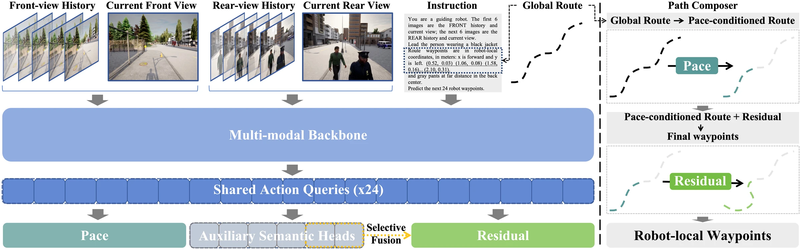

# LeadVLA — policy and training components

[Repository](../README.md) · [LeadInfra](../leadinfra/README.md) · [LeadBench](../leadbench/README.md) · [Examples](../examples/README.md)

LeadVLA combines a stable nominal **Path**, follower-aware **Pace**, and a learned
local **Residual**. Shared action queries support both control and six semantic
objectives. Only soft lateral and formation predictions directly modulate the
Residual branch; Pace uses the unfused representation.

<p align="center">
  <a href="../docs/figures/method.webp"></a>
</p>

## Code map

| File | Main interface | Responsibility |
| --- | --- | --- |
| [inputs.py](inputs.py) | `InputBuilder`, `PolicyInput` | Causal RGB history, route hint and instruction |
| [model.py](model.py) | `LeadVLA`, `ControlHeads`, `FollowerHeads` | One backbone pass, action queries, Pace and selective semantic fusion |
| [path_composer.py](path_composer.py) | `ArcLengthPathComposer`, `ComposerConfig` | Rate-limited progress and deterministic trajectory composition |
| [targets.py](targets.py) | `encode_semantics`, `normalized_box`, `spatial_labels` | Label encoding and validity masks |
| [losses.py](losses.py) | `joint_loss`, `residual_targets`, `LossWeights` | Action/semantic objectives and expert-relative Residual targets |
| [training.py](training.py) | `optimizer_for`, `start_stage`, `ValidationSelector` | Parameter groups, stage reset and checkpoint selection |
| [inference.py](inference.py) | `PolicyBackend`, `predict_waypoints` | Backend output validation and composition |
| [infer.py](infer.py) | `python -m leadvla.infer` | Single-query inference CLI |

## Install and run

Run commands from the **repository root**:

```bash
python -m pip install -e '.[policy]'
python -m examples.control_training
```

The example runs a CPU forward/backward exercise with synthetic tensors and a
small test decoder. It prints action, semantic and total losses. It requires no
checkpoint and does not simulate a robot or train the paper's full model.

## Compose a trajectory

This self-contained example queries a straight route at half nominal Pace:

```python
import torch
from leadvla.path_composer import ArcLengthPathComposer

progress = torch.arange(1, 25, dtype=torch.float32).unsqueeze(0) * 0.15
route = torch.stack((progress, torch.zeros_like(progress),
                     torch.zeros_like(progress)), dim=-1)

result = ArcLengthPathComposer()(
    path_reference=route,
    path_progress=progress,
    scale_target=torch.tensor([0.5]),
    scale_executed=torch.tensor([0.5]),
    residual=torch.zeros_like(route),
)

assert result["waypoint"].shape == (1, 24, 3)
print(result["query_progress"][0, -1].item())  # Approximately 1.8 m
```

The Composer scales **arc-length increments**, interpolates XY and unwrapped
heading, then adds the Residual. Its defaults are 24 steps, 0.2 s per step,
0.75 m/s nominal speed, 0.5 m/s² acceleration and 0.6 m/s² deceleration.
The explicit route origin defaults to robot-local zero; provide `path_origin`
when the reference begins with an offset.

## Prepare policy inputs

`InputBuilder.observe(front_rgb, rear_rgb)` accepts synchronized uint8 RGB arrays
at 10 Hz. Call `reset()` at each episode boundary, then `build(...)` when a
prediction is needed.

| Input | Shape / meaning |
| --- | --- |
| Front/rear observation | Each `[height,width,3]`, uint8 **RGB**, not BGR |
| `instruction` | Natural-language appearance, distance and formation request |
| `path_reference` | `[24,3]`: robot-local x, y, heading |
| `path_progress` | `[24]`: nonnegative arc length from the route origin |
| `path_origin` | `[3]`: origin pose, default zero |
| `executed_pace` | Previous executed scale in `[0,1]` |

The result contains 12 resized 384 × 384 images: five historical observations
and the current image for the front view, then the same for the rear view.
The first 10 route XY points enter the prompt; the full 24-point route remains
available to the Composer. Target IDs, hidden behavior programs, expert detours
and future event schedules do not belong in these policy inputs.

## Integrate a model backend

**Requires external model components and weights.** `LeadVLA` accepts a supplied
multimodal backbone and Residual decoder. The backbone returns hidden states for
exactly 24 action-query tokens. The Residual decoder maps `[B,24,D]` queries to
`[B,24,3]` local adjustments. Tokenizer/processor integration is application-specific.

The inference CLI uses a trusted `module:factory` backend:

```bash
python -m leadvla.infer \
  --backend your_backend:load \
  --checkpoint checkpoints/model.pt \
  --observations observations.npz \
  --instruction "Lead the person wearing a teal top and red pants at far center." \
  --executed-pace 0.5
```

`your_backend:load` is a placeholder for your implementation, not a bundled module.
The factory receives `checkpoint=Path(...)` and returns an object implementing
`predict(images, prompt)`. That method returns floating-point tensors:

| Output | Shape | Meaning |
| --- | --- | --- |
| `pace` | `[1]` | Desired scale in `[0,1]` |
| `residual` | `[1,24,3]` | Local XY and heading correction |

The NPZ stores `front_rgb` and `rear_rgb` histories `[N,H,W,3]`, together with
`path_reference`, `path_progress` and `path_origin`. The CLI prints composed
waypoints and intermediate progress information as JSON. It does not download
weights, drive robot hardware or replace a missing backend with test predictions.

## Training utilities

The [training configuration](../configs/training.json) records the model settings
and two-stage training protocol. The utilities implement:

- Smooth L1 waypoint, Pace and Residual regression with validity masks.
- Residual magnitude and adjacent-step smoothness penalties.
- Target-box regression and five semantic classification objectives.
- Separate backbone, Residual and control-head optimizer groups.
- Fresh optimizer/scheduler state for Stage 2 and minimum-validation-loss selection.

The full objective is `L_action + 0.25 L_semantic`. Freeze the actual vision tower
before creating optimizer groups. Dataset loading, distributed training,
backbone integration and trained weights must be supplied separately; the JSON
configuration is not a complete training launcher.

## Tests and further reading

```bash
python -m unittest tests.test_inputs tests.test_path_composer tests.test_model_training -v
```

See [architecture and objectives](../docs/architecture.md),
[policy input contract](../docs/policy.md), and the runnable
[control example](../examples/control_training.py).
